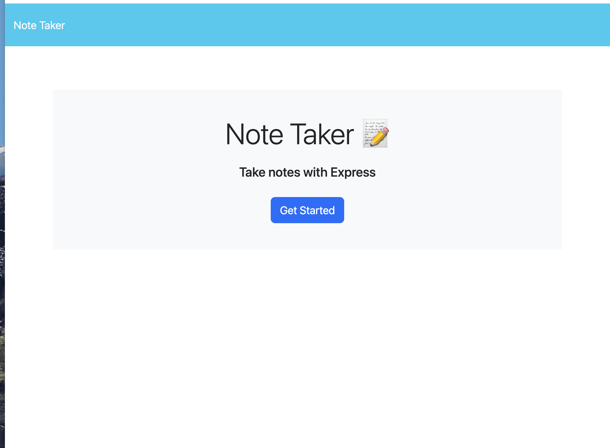
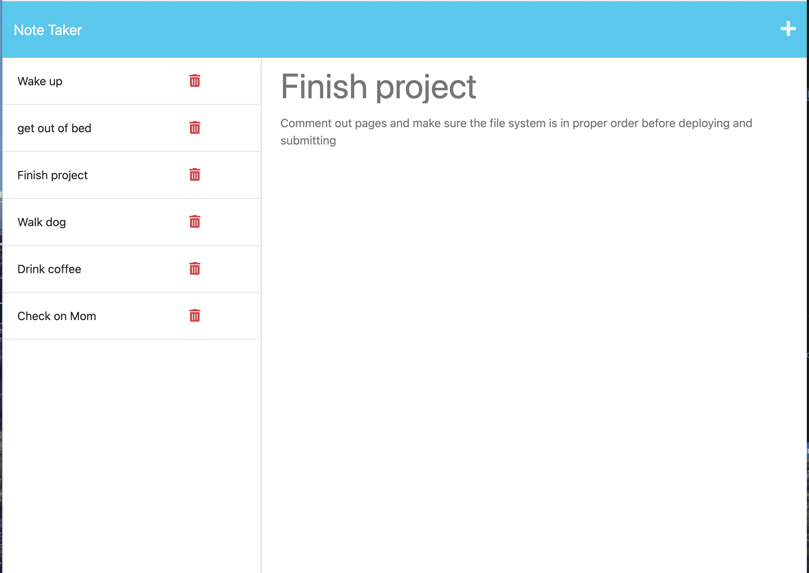

# Phils_Note_Taker
  -------------------
  ## Badges
  -------------------
    
  ## Table of Contents  
  ----------------------
  - [Description](#description) 
  - [Usage](#usage)  
  - [Installation](#installation)   
  - [Contributing](#contributing)  
  - [Questions](#questions)
  - [License](#license)
    

  ## Description  
  -------------------
  This is a note taking application. The app allows you to enter notes which are then saved on the server and displayed to the left side of the page.  You can click on a note to see it fully displayed as well as delete notes that you have finished. When you return to the page you existing notes are recalled by the server and displayed back to you.

  ## Usage  
  ------------
  Navigate to the URL and click on the 'get started' button which will navigate to the notes entry page with a list of saved notes that you can add to or delete from. Type a new note in the right side display and click the  save icon.  Your new note will be displayed in the list on the left.  If you click a previous note the note information will display on the right. Click the + icon to add a new note.

  URL: [https://phils-note-taker.herokuapp.com/](https://phils-note-taker.herokuapp.com/)

  Screen shots:
  
  
 
  ## Installation  
  -------------------
  Clone this repo and run `npm install` to load the npm data and run `node server.js` in the command line.

  ## Credits 
  ------------------
  The front end of this application was provided by the Rice Bootcamp course. I was aided in the backend by [Expressjs](https://expressjs.com/) docs and [MDN](https://developer.mozilla.org/en-US/) docs. I also recieved troubleshooting assistance from David Gaither through the AskBCS learning assistant chat in Slack.

  ## Contact Information
  -------------------------
  ### Github: [Phillip Pfister](https://github.com/phil-pfister)
  ### Email: salshouse@gmail.com

  
  ## License 
-------------- 
This application uses the The [Unlicense](./LICENSE).
  

